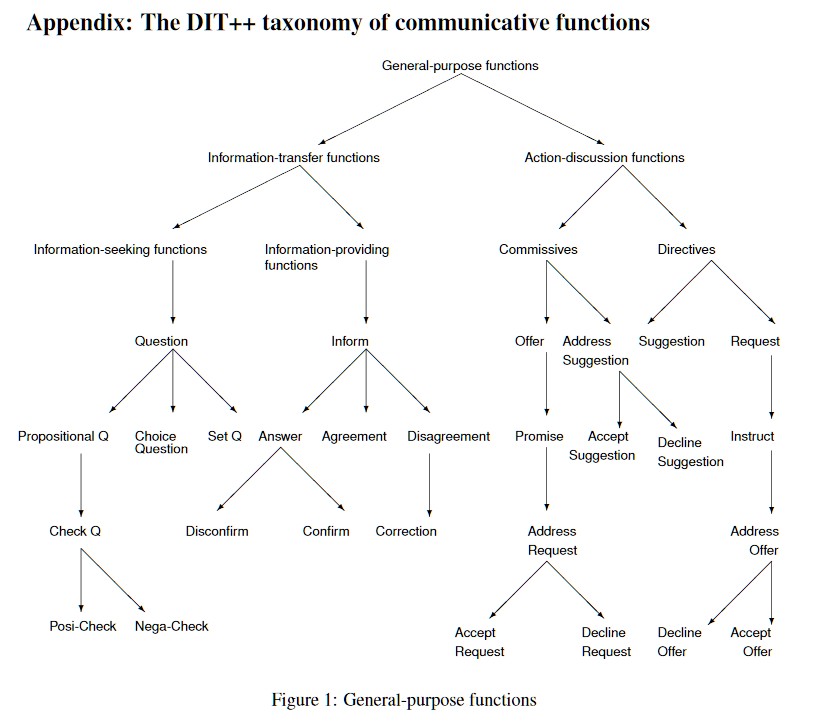
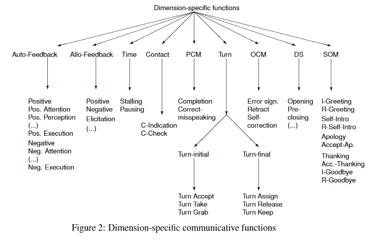
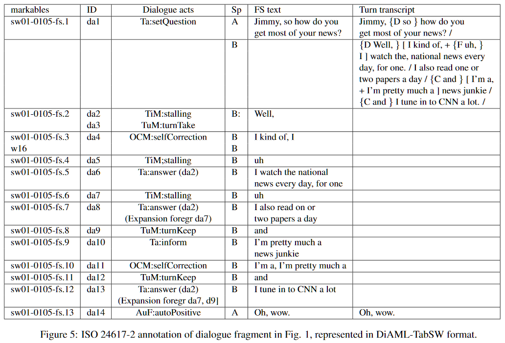

# Chapter 17. Computational Pragmatics
by Harry Bunt

## 17.1 General and Computational Pragmatics
* 계산 화용론은 발화의 언어적 속성과 발화가 사용된 맥락의 측면(aspects)간의 관계를 말뭉치 데이터, 맥락모형, 알고리즘과 같은 계산적 방법을 통해 연구하는 분야로, 맥락-의존적 발화생성과 해석을 중요하게 다룬다.
* 맥락과 언어형식과의 관계는 분명하다.
  * 전제(presupposition)
       명사구의 한정사의 사용은 화자가 청자와 공유한다고 믿는 가정에 대한 정보를 드러낸다.
   * Given-new structuring
       문장구조를 통해 화자는 청자가 이미 알고 있다고 생각하는 바와 모른다고 생각하는 것을 구분하여 제시하려 한다.
   * Topic-focus mapping
       어순을 통해 화자는 청자가 주목해야 할 내용을 표시한다.
* 대화에서 발화의 맥락이란 이전의 내용과 상호작용에 의해 구성되지만, 또한 사회적 예의나 인지적 맥락에 의해서도 영향을 받는다.
* 사회적 예의나 인지적 맥락과 같은 지각적 정보는 본질적으로 다이내믹하다. 대화가 진행되면서 그 정보는 변화하고 대화의 결과가 된다. 따라서 대화맥락은 소통의 효과와 함께 연속적으로 변화한다.
* 대형 말뭉치 자료가 소프트웨어를 통해 분석이 가능해지면서 화용론 연구는 보다 체계적이고 경험적 분석이 가능하게 되었다. '대화행위 이론'이 하나의 예인데, 현대 대화행위 이론은 전통적인 화행이론보다 더 많은 action type과 더 다양한 소통행위 개념들을 갖고 잇다.
* 대화함축과 간접화행은 청자의 추론능력에 의존하는데, 이는 듣는 이가 맥락정보와 발화정보를 종합하여 화자가 의도한 의미를 파악할 수 있다고 가정한다는 것을 뜻한다.
* 맥락기반 추론은(context-based inference) 대화의 발화를 이해하기 위해선 반드시 필요하다. 가장 간단한 예는 '예' 혹은 '아니오'로, 이런 응답은 앞선 발화의 의미를 이해하지 못한다면 이해될 수 없는 발화이다.
* 에제 1: Declarative question
    C: What departure times do you have for flights to Munich early in the morning?
    I: I have Lufthansa at 07:15, KLM at 07:25, again KLM at 07:50, and another Lufthansa at 08:20
    C: **and that's on Saturday too**
    I: and that's on Saturday too
* 예제 1에서와 같은 형태의 질문은 information-seeking dialogue 말뭉치에서 20%의 적지 않은 비중을 차지한다.(Beun, 1989) 이 예제는 대화에서 일어나는 발화의 해석은 추리(inferencing)을 요한다는 것을 보여준다.
* 추리란 예외처리가 아니라 규칙에 의한 것이며, 해석과 추리는 서로 맞물리는 과정이다.

## 17.2 Inferencing in Computational Pragmatics
* 추론의 3가지 형태
  * Deductive inference
  * Inductive inference
  * Abductive inference
* 연역추론은 주어진 전제와 사실들을 통해 새로운 판단을 논리적으로 도출하는 방식의 판단을 말한다.
  * 까마귀에는 '검다'는 의미가 있다 & 대상의 이름은 그 속성을 반영한다 => 까마귀는 모두 검은색이다
* 귀납추론은 경험 데이터를 일반화하는 방식의 추론을 말한다.
  * 까마귀 관찰 => 까마귀는 모두 검은색이다
* 귀추는 관찰에 근거해 가설들을 만들고 가장 그럴듯한 가설을 선택하는 방식의 추론을 가리킨다.
  * "도로가 젖었다"(관찰) & "비가 내리면 도로가 젖는다"(지식) => "비가 내렸었다"(귀추적 판단)
* 연역추론은 과학에서는 널리 쓰이나 일상적 추론에서는 잘 쓰이지 않는다. 반면에 귀납과 귀추는 우리가 일상적으로 쓰는 직관적 방식의 추론이다.
* 귀납은 세계에 대한 모델을 구성할 때 특히 많이 쓰이고, 귀추는 관찰의 해석에 대해 중요하게 쓰인다. 특히 귀추적 판단은 대화상황의 해석에서 중요하다.
* 여기서 떠오르는 중요한 문제는 그 해석들 중 어떤 해석이 다른 해석보다 어떻게 선호되는지를 밝히는 것이다.
  * wet_street(O) <= raining(P1) or pipe_burst(P2)
* Weighted abduction (Stickel, 1988)
  * 짧은 증명은 긴 증명보다 비용이 더 적다 => 적은 비용의 증명이 보다 그럴듯한(plausible) 설명이다
  * 'Interpretation as abduction' (Hobbs, 1990b; Hobbs et al., 1993)
* 예제 (Hobbs et al., 1993)
  > (2) The Boston office called

  * 이해되어야 할 요소들
    * 정관사 'the'
    * 'Boston office'에서 'Boston'과 'office'의 관계
    * 'office'와 'making a phone call'의 환유적 관계
  * 지식기반을 이용한 해석
     (3) boston'(x) EXT office'(y) EXT NN(y, x)
     (4) office'(B1), located-in(B1, B), boston'(B)
  * 일반지식
     located-in(x, y) => NN(x, y)
* 예문 (2)의 해석은 지식기반과 일반지식의 귀추적 조합을 통해 도출될 수 있다. 만일 Boston에 위치한 다른 office들이 지식기반에 있다면, 가중치(weights) 계산을 통해 가장 그럴듯한 대안을 선택하면 된다.
* NLU 시스템에선 이와같이 특정 상황정보와 일반적 지식을 종합한 형태의 추론이 필요하다.
* Mini-TACITUS (Ovchinnikova, 2014) 시스템은 weighted abduction을 이용한 시스템으로, WordNet과 FrameNet과 같은 말뭉치 자료를 적극적으로 활용하였다.
* 계산 화용론이 필요로 하는 세 가지 도구
  * 추론을 위한 계산 알고리즘
  * 화용적 속성이 주석된 말뭉치 자료
  * 지식과 맥락에 대한 계산적 표현체계

## 17.3 Language as Action in Context
### 17.3.1 Speech acts and dialogue acts
* 계산 화용론에서 '대화행위'는 행위의 수행으로서의 언어사용을 모델링한다. 이것은 의사소통 행위를 모형화하고자 하는 경험기반 접근법을 취한다.(ISO 24617-2:2012)
* 대화행위 이론은 '정보-상태 갱신' 혹은 '맥락-변화' 접근방식을 취한다. 이 접근법은 대화 참여자들의 정보상태에 갱신작용을 함으로써 소통행위의 의도된 의미를 밝히고자 한다.
* "Do you know what time it is?"
  * 대화행위의 두 주요 요소: semantic content, communicative function
  * 대화행위의 소통적 기능은 위 예제의 질문이 '질문'의 기능을 하는지 아니면 '힐난'의 기능을 위한 것인지를 구분해준다. 만일 전자라면, 대화의 의미적 내용을 이용해 청자의 정보상태를 질문자가 현재시간을 모르며 그것을 알기 원한다는 정보로 갱신하게 된다. 반면 후자라면, 질문자는 현재 시간을 알고 있으며 그 정보를 요구하는 것이 아니라는 정보를 정보상태에 입력하게 된다.
* 화행이론과 대화행위 이론의 차이점
  1. 대화행위는 구어행위 뿐만 아니라 비-구어적, multi-modal 행위를 다룬다.
  2. 화행이론은 모든 발화가 하나의 화행을 담는다고 가정하지만, 대화행위 이론은 발화가 다기능적이라고 본다.
  3. 대화행위는 대화 참여자의 정보상태에 대해 갱신작용에 의한 계산적 의미론을 갖는다.
  4. 대화행위는 의미적, 화용론적 관계를 갖는 다른 대화행위에 의존적이며, 의미적으로 고립되어 있지 않다.
### 17.3.2 Dialogue segmentation
* 구어 대화는 복수의 'turn'들도 분절화된다. 그리고 한 '턴'은 더 작게 분절화될 수 있다.
  > 예제 (8)
   A: Yes! Come tomorrow. Go to the church. Bill will be there. OK?
   B: The church, OK.

  * 5 functions in A: (1) Feedback giving, (2) Request, (3) Request, (4) Statement, (5) response elicitation
* 분절의 경계를 문법성이나 운율같은 요소로 판단하기는 어렵다. 기능적 분절(functional segment)이 하나의 대안이 될 수 있다. 즉, 하나의 소통적 기능이 수행되는지의 여부로 분절화하는 것이다.(Geertzen et al., 2007)
* 기능적 분절은 비연속적일 수 있다.
  > 예제 (10)
   A: Do you know what time the next train leaves?
   B: [The next  train is] ... \<let me see\> ... [at 7:48]

  * \[...\]: answer_function
  * \<...\>: stalling_function
  > 예제 (11)
   a. A: and what departure times do you have on Saturday
   b. B: on Saturday I have a Lufthansa flight in the morning leaving at 8:15.
   c. A: yes,
   d. B: and a KLM fligth at 08:50,
   e. A: yes,
   f. B: and a Garoeda flight at 10:30.

* 예제 문장 (11)은 기능적 분절이 한 턴 이상 연장될 수 있음을 보여준다.(multi-turn answer)
  > 예제 (12)
   A: and then, *what* is the, ehm, *the branch office admin*, ehm, ...
   B: *booking code*- the admin booking code for this office is 14 2600

* 예제 문장 (12)는 기능적 분절이 여러 화자에 의해 구성될 수 있음을 보여준다.
  > 예제 (13)
   A: what time did he say the meeting will resume?
   B: uhm, two-thirty I think

* 예제 문장 (13)은 기능적 분절이 항상 문법적으로 적법하지는 않다는 것을 보여준다.
* 이러한 기능적 분절화 전략은 대화를 의미단위로 분절화하는데 효율적인 대안이 될 수 있다.

### 17.3.3 Multifunctionality in utterances
* 발화에서 다기능성 분절은 'overlapping', 'discontinuous', 그리고 'interleaved' 형태로 복잡하게 나타난다.
  > 예제 (14)
   I think twenty five euros for a remote ... *is that locally something like fifteen pounds* ... is too much money to buy an extra remote or a replacement one ... or *is it even more?*

* 예제 (14)는 다기능성 분절이 'inter-leaved' 형식으로 나타나는 양상을 보여준다.
* 기능적 분절개념은 예제 (14)를 성공적으로 두 파트로 분절화할 수 있다.
  > 예제 (15)
   A: and so [<ins>we started in</ins> [uh, ... ,] <ins>we started from</ins>] an empty lot

* 예제 (15)는 discontinuous 다기능성이 나타나는 것을 보여준다. 그리고 기능적 분절화는 이것 또한 4개의 분절로 분리할 수 있다.
* 이런 예제들은 기능적 분절개념이 발화의 다기능성 분절을 처리하는데 유용하다는 점을 잘 보여준다.

### 17.3.4 Dialogue act interpretation
* 대화행위가 전통적인  화행과 다른 두 가지 차이점
  * 대화행위는 보다 분명한 내적구조를 가진다.
  * 대화행위의 계산적 해석은 정보상태 변화에 따라 이루어진다.
* DiAML (Dialogue Act Markup Language) by Bunt (2011, 2014)
  * ISO annotation standard 24617-2
  * 정보상태는 '대화이력'이라는 요소를 가지며, 이것은 대화에 나타난 내역을 기록하게 된다.
  * 정보상태는 또한 'pending context'라는 부분을 가지며, 이것은 정보상태를 갱신하기 전에 consistency check를 위해 갱신관련 정보들을 임시저장한다.
  * DIT++: taxonomies of dialogue act types
  * 갱신 과정의 예: propositional question
    > (16)  
    
  * 예제 (16)의 X와 Y는 각각 대화행위의 송신자와 수신자를 가리키고, Yp는 수신자의 pending context를, p는 질문의 명제적 내용을, U는 정보 갱신작용을 가리킨다.
    > (17) 
    U10(X, Y, Yi, P): Y의 pending context에 참가자 X가 명제 P인지를 알기 원한다는 정보를 추가한다. 
    U11(X, Y, Yi, P): Y의 pending context에 참가자 X가 참가자 Y가 명제 P인지를 알기 원한다고 가정한다는 정보를 추가한다.
  
* 대화행위 의미론 접근법은 대화행위 간의 추론을 설명할 수 있다.
  * 'Confirm' 행위는 'Answer' 행위를 전제한다.
  * 'Threat' 행위는 'Inform' 행위를 전제한다.

### 17.3.5 Dialogue acts and grounding
* 대화에서 grounding이란 대화중 참여자가 인지된 공통분모(common ground)를 새로운 요소를 추가하며 갱신(update)함을 가리킨다.
* Matheson et al. (2000)은 정보상태 갱신적 관점에서 grounding act를 통해 정보상태의 ungrounded 담화유닛이 grounded 되는 과정을 모형화하고자 노력했으나 이전 발화정보를 제한하였다는 한계가 있었다.
* Bunt et al. (2007)은 대화행위의 DIT 이론에 근거한 grounding 계산 모형을 제시하였다. 이 모형은 'feedback chaining principle'을 받아들여, 화자와 청자는 '긍정' 피드백을 통해 서로 공유하는 공통분모를 순차적 방식으로 강화한다고 보았다.

  > (19) 
  a. U: Where should I insert the paper? 
  b. S: In the feeder. 
  c. U: Should I put it in the bottom from tray? 
  d. S: No, in the open tray on top. 
  e. **U: OK thanks.**
  
* 예제 (19)의 e를 통해 참가자 S는 U가 paper가 위치해야할 장소가 어디인지에 대한 의미가 공통적으로 확인되었다고 여기기 된다.

## 17.4 Relations in Dialogue and Discourse
* 기능적 의존관계(functional dependence relation)
  > (20) 
  a. A: I'm expecting Jan, Alex, Claudia, and David, and maybe Olga and Andrei. 
  b. B: Do you know who's coming tonight? 
  c. B: Which of the people from the project will be there tonight? 
  
  * 위 예제는 현재 대화행위가 연결된 이전의 대화행위 의미내용에 의해 영향을 받는 양상을 보여준다. (20a)의 답변의 의미는 (20b)와 (20c)라는 각각 다른 질문에 따라 그 의미가 다르게 결정된다.
  
* 피드백 의존관계(feedback dependence relation)
  > (21) 
  a. A: Is this flight also available on Thursday? 
  b. B: On Thursday you said?
  
  * (21b)는 (21a)의 대화행위가 아니라 발화에 대한 응답이다. 이와같이, 이전에 있었던 발화내용의 인지 혹은 해석을 나타내는 대화행위는 이전 내용과 피드백 의존관계를 갖는다.
  * 긍정 피드백은 언어적 표현 뿐 아니라 제스처와 같은 형태로도 흔히 표현된다.
* Exemplication and Explanation relations
  > (22) 
  a. A: it ties you on in terms of the technology and the complexity that you want  
  b. A: like  for example voice recognition 
  c. A: because you might need to power a microphone and other things 
  
  * (22b) --> (22a): exemplication relation
  * (22c) --> (22a): explanation relation
  * 이 관계는 **rhetorical relation**, **coherence relation**, **discourse relation** 등의 이름으로도 불린다.
* 상당수의 기존 연구들에서 연구된 관계들은 일반 텍스트 데이터에 대한 것들 뿐이었다.

## 17.5 Computational Resources for Discourse and Dialogue Pragmatics
### 17.5.1 Corpora, standards, and other tools
* 다른 자연어 처리 연구분야와 마찬가지로 큰 규모의 주석된 말뭉치 자료는 매우 중요하지만 현재 부족한 실정이다.
* 대규모의 주석된 화용론 말뭉치 제작을 위해선 (1) 잘 정의된 표준적인 주석체계, (2) 그런 표준 주석체계를 지원하는 소프트웨어 도구가 필요하다.

### 17.5.2 Annotation schemes
* DAMSL: Dialogue Act Markup using Several Layers (1997)
  * 대화 데이터 주석을 위한 선구적인 시도
  * 소통기능이나 대화차원에 대한 정의의 미비, 미완성으로 끝남
* DIT++ annotation scheme
  * 다양한 대화행위 유형을 지원하고 대화의 차원을 소통의 특정 요소(aspects)에 맞는 대화행위의 묶음으로 정의함
  * DAMSL을 포함한 다양한 기존의 scheme들의 소통기능 정의들을 지원하며, 차원과 소통기능을 구분하여 분류체계를 제공함
  * ISO 24617-2에 이용됨 (Bunt et al., 2010)

### 17.5.3 Software tools
* 대화데이터 주석용 툴
  * DialogueView (Heeman et al., 2002)
  * ACT (Yang et al., 2002)
  * GATE (Cunningham, 2002)
  * NITE XML toolkit (Carletta et al., 2009)
  * ANVIL (Kipp, 2001)
  * ELAN (Wittenburg et al., 2006)
  * MMAX2 (Muller and Strube, 2003)
* 담화 관계 주석용 툴
  * RSTTool (O'Donnell, 2000)
  * Conano tool (Stede and Heintze, 2004)
* 자동 대화행위 주석 툴
  * Petukhova (2011)
  * 구어 대화 데이터를 DIT++와 ISO 24617-2 표준에 따라 다차원 주석을 성공적으로 수행함
  * AMI 말뭉치와 HCRC 말뭉치에 적용시 정확도 96% 기록 (Petukhova and Bunt, 2011)
  
### 17.5.4  Annotated corpora
* Penn Discourse Treebank (PDTB): 뉴스기사 데이터 주석
* Postdamer Commentary Corpus: 뉴스기사 데이터 주석
* 대화 데이터 주석 말뭉치
  * Switchboard corpus
  * ICSI-MRDA corpus
  * AMI corpus
  * HCRC Map Task corpus
* 대부분의 말뭉치들은 데이터 영역에 따라 주석방식이 상이함. ISO 24617-2에 따른 대화주석 말뭉치는 현재 개발중 (DialogBank)
  * [Corpus site](https://dialogbank.uvt.nl/annotated-dialogues/)
  * Example [(Bunt et al., 2016)](https://www.aclweb.org/anthology/L16-1503) and 
  

## 17.6 Conclusion and Perspectives
* 계산 화용론 연구를 위해서는 대규모의 화용론 주석 데이터가 반드시 필요하고, 이 때문에 ISO 24617-2 표준의 탄생은 중요하다.
* Mini-Tacitus와 같은 귀추적 추론 시스템은 대화함축이나 맥락기반적 해석과 같은 화용론적 현상의 연구를 크게 도울 것이다.
* 계산 화용론은 해석과 생성, 추론과 학습에 대한 계산모형을 제공함으로써 언어와 맥락이 어떻게 상호작용하는지를 설명하는데 기여할 것이다.
