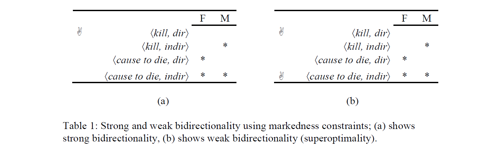
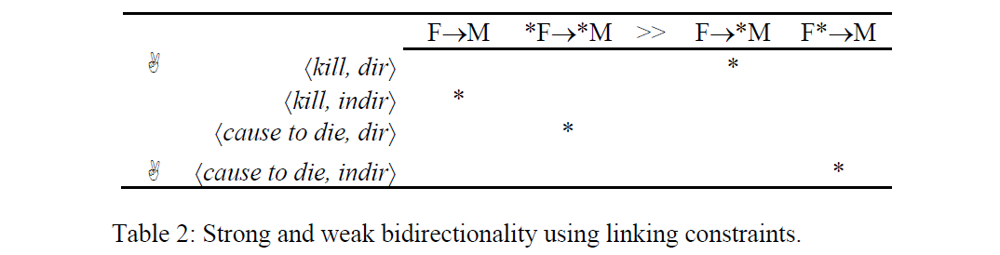
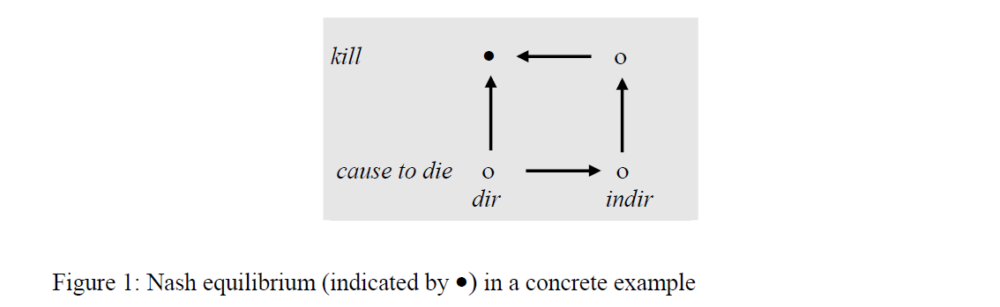

# Chapter 5. Formal Pragmatics
by Reinhard Blutner

## 5.1 Introduction
* 인문학적 연구주제에 수리논리적 모형을 적용하는 것에 의구심이 있을 수 있으나, 물리학에서도 수학적 이상화와 추상화는 많이 사용된다.
* 화용론 분야에서 일하는 적합성 이론과 최적성 이론가들은 자연주의적 태도를 취하는데, 이것은 화용론 연구자들의 전통적 태도인 규범적 태도와는 배치되는 것이다.
* 분명 그라이스의 협력의 원리와 같은 격률들은 규범적 속성을 갖는 것처럼 보인다.
* 하지만 인간행동에 대한 규범주의적 관점과 자연주의적 관점이 분명하게 다른 설명과 예측을 제공하는 때도 있으나 많은 경우 오히려 일치한다.
* 이 글에서는 자연주의적 설명을 추구하는 이론적 모형인 '최적성 이론 기반 화용론', '게임 이론 기반 화용론', '결정 이론 기반 화용론'을 다루고자 한다.

## 5.2 Optimality-Theoretic Pragmatics
* 최적성 이론은 통합적 인지 이론으로, 기호처리 모형의 장점과, 신경망 모형을 이용하는 제약만족(constraint-based) 모형의 장점을 종합하여 취하는 것이 특징이다.(Smolensky and Legendre, 2006)
* 최적성 이론은 언어학 분야에서 음운론, 형태론, 통사론과 자연어 습득과 그 외 현상적 특징을 성공적으로 설명해왔다.
* 최적성 이론은 적합성 이론과 유사하게 언어현상에 자연주의적 관점을 취하고 있으며, 다음과 같은 급진적 화용론의 주장을 받아들인다.(Jaszczolt, 2010)
  * There is a level of logical form or semantic representation. The representations of this level do not necessarily provide truth conditions. Rather, they underspecify truth-conditional content in a number of ways. -> 진리조건이 커버하지 못하는 의미표상 수준이 존재한다.
  * There is a mechanism of enriching underspecified representations; sometimes this mechanism is called development of logical form. The result of this development is propositional content. It expresses the utterance meaning of the expression under discussion. -> 논리형식이 변환되는 기제가 존재한다.
  * There is a level of implicatures proper, understood as separate thoughts implied by the utterance. It is implicit propositional content that can be inferred from the explicit content mentioned in 2. -> 함축을 통해 처리되는 해석의 수준이 존재한다.
* 위에서 볼 수 있듯이, 최적성 이론도 논리형식이 문자적 의미와 일치된다는 전통적 입장을 거부하고 논리형식은 표현된 의미내용에 따라 명시되고 함축은 어떤 논리형식과 다른 논리형식보다 더 멀거나 가까울 수 있다는 입장을 받아들인다.

### 5.2.1 Three Variations on Grice
* 최적성 이론은 그라이스 화용론의 세 가지 변형모형(relevance theory, Levinson's (2000) theory of presumptive meaning, Neo-Gricean approach)을 모두 체계적으로 통합하는 이론이다.
* 대화함축 접근법의 두 가지 구별
  * Global (neo-Gricean) view: 문장의 일반적 의미를 처음에 파악하고 함축을 통해 적합한 대안을 고려한다.
  * Local view: 부분적으로 화용적 가설들을 적용한 다음 제약기반적 방식으로 이들을 조합한다.
* Global view는 합리적 담화해석에 적합한 반면, local view는 실시간 처리과정을 설명하는데 이점을 지닌다.
* OT는 위 두 입장의 장점을 체계적으로 통합한다.
* 적합성 이론(RT)은 *communicative principle of relevance* 에 기초하여 모든 발화는
  * 첫째, 적어도 청자의 처리 노력에 걸맞게 적합해야 하며.
  * 둘째, 화자의 현재 지식상태와 목적/선호에 맞도록 최대한 적합해야 한다.
* 위 두 가정에 기초하여, RT 이론은 발화를 처리하는 인지 시스템은 다음의 일반적 과정을 갖는다고 본다.
  1. 접근하는 순서에 따라 가능한 해석들을 테스트한다.
  2. 최적 적합도에 도달하면 처리과정을 멈춘다.
* Levinson’s (2000) theory of presumptive meaning은 RT와 유사한 측면과 유사하지 않은 측면을 동시에 활용하는 이론이다.
* 레빈슨은 의미의 세 가지 수준을 가정한다:
  * 문장 유형의 의미
  * 발화 유형의 의미
  * 발화 토큰의 의미
* 발화 수준의 의미는 그라이스의 기존 대화함축과 유사하며 다음의 세 가지 휴리스틱에 따라 처리된다.
  * Q-휴리스틱: 언급되지 않은 것은 해당되지 않는다.
  * I-휴리스틱: 단순하게 표현된 것은 전형적으로 예시된 것이다.
  * M-휴리스틱: 비정상적으로 언급된 것은 정상적이지 않은 것이다.
* 하지만 그라이스의 global view 와는 달리, presumptive meanings는 local하게 구성된다.(예를 들면, 'some'이란 단어는 Q-휴리스틱을 통해 NOT ALL 이란 디폴트 해석을 일으킨다.)
* 이와 같은 local 화용론적 자질들은 인공지능을 위한 화용론에는 중요한 요소이다.
* 신-그라이스식의 화용론은 Q-원리와 R-원리를 가정하는데, 이 둘은 서로 상충되면서 상호보완적으로(화용론적 작업분담) 작동한다고 본다.

### 5.2.2 Bidirectional OT
* 쌍방향 최적성 이론은 언어형식과 언어의미 간의 최적점을 찾는데 있어 일반적 절차를 제공한다.
* 의미-형식 쌍에 대한 쌍방향 최적성은 (1) 강한 방식과, (2) 약한 방식으로 나누어진다.
* Formalism of Bidirectional OT
  * Generator: **Gen** &#8838; **F** X **M** gives the set of all potential form-meaning pairs
  * &#12296;**GEN**, **&#8827;**&#12297;: OT-system for form-meaning pairs
  * *f' &#8827;m f* says that the pair &#12296;*f'*, *m*&#12297; satisfies the system of (ranked) constraints better than the pair &#12296;*f, m*&#12297;.
  * *m' &#8827;f m* says that the pair &#12296;*f*, *m'*&#12297; satisfies the system of (ranked) constraints better than the pair &#12296;*f, m*&#12297;.
* In the strong version of bidirectional OT, a form-interpretation pair &#12296;*f, m* &#12297;&#8712; **GEN** is considered to be (strongly) optimal iff
  * Interpretive Optimization: there is no pair &#12296;*f, m'* &#12297;&#8712; **GEN** such that *m' &#8827;f m*.
  * Expressive Optimization: there is no pair &#12296;*f', m* &#12297;&#8712; **GEN** such that *f' &#8827;m f*.
* 첫번째 조건은 *m* 이 *f* 에 대한 최적의 해석이라는 것을 뜻하고, 두번째 조건은 *f* 가 *m* 에 대한 최적 표현이라는 것을 가리킨다.
* A form-interpretation pair  &#12296;*f, m* &#12297; &#8712; **GEN** is considered to be super-optimal (or weakly optimal) iff
  * Interpretive Optimization: there is no super-optimal pair &#12296;*f, m'* &#12297;&#8712; **GEN** such that *m' &#8827;f m*.
  * Expressive Optimization: there is no super-optimal pair &#12296;*f', m* &#12297;&#8712; **GEN** such that *f' &#8827;m f*.
* 예제 (1)
  a. Black Bart killed the sheriff
  b. Black Bart caused the sheriff to die
* 위 예제에서 두 개의 형식(kill and cause to die)은 두 개의 해석(직접적, 간접적)을 갖는다.
* 그럼 다음의 네 개의 가능한 형식-의미 쌍이 **GEN** 에 의해 생성된다: <kill, dir>, <kill,  indir>, <cause to die, dir>, <cause to die, indir>.

* Table 1에서 F (for forms)는 복잡한 형식에 대해서 마크되며, 유사하게 M (for meanings)은 보다 복잡한 해석에 대해서 마크된다.
* Table 1a의 BOT의 strong 버전을 보여주는데, 이 경우에는 오직 <kill, dir> 쌍 만이 유일하게 최적 쌍이 된다.
* 하지만 Horn의 화용론적 작업분담 원리는 이를 예측하는 반면, BOT의 strong 버전은 <cause to die, indir> 형식-의미 쌍이 선호되는 경우가 발생한다는 것을 설명하지 못한다.
* Table 2b는 BOT의 weak 버전이 적용되는 경우에 그런 문제가 발생하지 않는다는 점을 보여주는데, 왜냐하면 <kill, indir>과 <cause to die, dir> 쌍이 super-optimal 하지 않기 때문에 <cause to die, indir> 쌍이 super-optimal 쌍이 되지 못하게 차단하지 못하기 때문이다.
* 이런 weak BOT는 인간의 언어인지 진화 과정에서 '화석화'된 과정으로 보인다.
* 이와 같은 '화석화' 결과를 linking-constraints 형태로 표현할 수 있다.(Table 2)

* F&#8594;M 은 단순한 형식이 단순한 해석을 표현한다는 연결제약을 표현한 것이고, 이는 레빈슨의 I-휴리스틱을 OT 제약으로 제약으로 풀이한 것이다.
* \*F&#8594;\*M 은 복잡한 형식이 복잡한 해석을 표현한다는 연결제약이다. 그리고 이것은 레빈슨의 M-휴리스틱의 내용과 같다.
* 인간의 일반적 학습 기제가 다른 두 개의 연결제약이 하위에 랭크된다는 것을 배운다면 strong 버전과 weak 버전은 이 측면에서는 동일한 결과를 가져오게 된다.
* BOT는 자언어의 다양한 화용적 현상을 설명하는데 널리 활용되고 있다.

## 5.3 Game-Theoretic Pragmatics
* 게임이론 기반 화용론은 후기 비트겐슈타인을 효시로 해서 Hintikka, Lewis 등에 의해 신호 게임을 언어 도메인에 적용하는 방법에 대한 논의가 이루어졌다.
* 이 게임은 문화 진화(cultural evolution) 현상의 하나로 표현되며, 신호 게임의 내쉬 평형과 유사하게 안정적 의미의 형성에 대한 수학적 정당화를 제공했다.
* 게임이론 기반 화용론은 크게 전략게임에 기반한 접근법과 신호 게임에 기반한 접근법이 있었다.
* 전략게임 접근법에서 참가자(화자와 청자)는 동시에 행동한다고 가정한다. 앞의 예제를 통해 설명하면, 화자는 (kill, cause to die) 중 하나의 언어표현을 선택할 수 있으며, 청자는 (dir, indir) 중 하나의 해석을 선택할 수 있다.
* 화자와 청자의 행위 쌍을 profile 이라고 부르는데, 각 프로필은 Figure 1 처럼 작은 원으로 표시할 수 있다.

* 전략 게임에서 내쉬 평형은 행위 프로필 쌍 <Sa, Ha> 이다.
* Figure 1의 수평방향의 화살표는 청자의 선호를 가리키는 것이며, 수직방향의 화살표는 화자의 선호를 나타내는 것이다.
* Franke (2009)는 OT 시스템이 이 접근법에 잘 적용될 수 있음을 주장했다. 그리고 사전 연구들에서 신호 게임 접근법을 통해 이와 같은 방법들이 논의되었다.
* 신호 게임의 기본적인 아이디어는 간단하다. 게임 참가자가 청자와 화자 두 명이 있다면, 먼저 무작위로 선택된 의미 *m* 이 화자에게 제시된다. 다음에 화자는 신호 *f* 를 골라 청자에게 전달한다.
* 그 신호에 기반해서 청자는 *f* 의 의미를 추측해야 한다. 만일 그 예측이 정확하다면, 화자와 청자 모두 점수를 얻는다. 만일 부정확하다면 아무런 점수도 얻지 못한다.
* 이런 프레임워크를 바탕으로 화자와 청자에 대한 효용 함수를 아래와 같이 표현할 수 있다.

  

* 수식 (2)에서 P(m)은 두 참가자에 공유된 사전 확률을 나타내며, sim(m, m')은 0에서 1까지의 값을 리턴하는 유사도 함수를, S(m)은 화자의 전략을 의미 *m* 에 적용한다는 것을 가리킨다. 그리고 H(f)은 청자의 전략은 형식 *f* 에 적용한다는 것을 뜻한다.
* 유사도 함수 sim은 따라서 화자와 청자가 같은 의미를 사용된 형식에 대해 공유한다면 유사도 1을 주게 된다. 즉, 서로 의도한 바를 잘 소통하게 되면 효용 함수의 값은 상승한다.
* 여기에 비용함수를 적용하는 것은 그리 어려운 일이 아니며 OT 패러다임에 따라 수식 (3)과 같은 방법을 적용할 수 있다.

  

* 수식 (3)을 이용해 신호 게임에서 참가자들은 효용 함수의 값을 최대화하는 전략을 찾아나갈 수 있다.
* 효용 함수를 통한 접근법을 이론적으로 뒷받침하는 시도는 진화 복잡계 모형(replicator dynamics)을 통해 이를 모델링하는 시도가 있었고, 특정 조건 하에서 super-optimal solution 쌍의 내쉬평형은 안정적이라는 연구가 있었다.(Maynard-Smith, 1982)
* 그 외에도 iterative learning theory, reinforcement learning for signaling games, iterated best response model 등을 통해 위의 접근법을 설명하려는 이론적 시도들이 있었다.

## 5.4 Decision-Theoretic Pragmatics
* 예제 (4) 
  a. Should we buy this ring? 
  b. It is nice but expensive. 
  c. It is expensive but nice. 
* 예제 (4b)와 (4c)의 진리조건은 같지만, 문맥 a를 놓고 보았을 때 둘은 전혀 다른 함축을 내포한다.
* Merin (1999)은 decision theory와 확률개념에 기초하여 화용의미론의 논증이론을 형식화했다.
* 그에 따르면, 논증이란 인식적 상태 간의 확률적 관계이다.
* 논증 A는 가설 H의 확률을 증진시킬때만 오직 가설 H에 대한 긍정적 논증이 된다.
* 이런 논증 관계를 'relation of relevance'라고 부르며 수식 (5)와 같이 표현한다.

  

* 긍정적 relevance는 rH(A)가 0 이상일 때 그리고 0 이하일 때는 부정적 relevance가 된다.
* 수식(5)의 단순한 귀결:

  

* 예제 (6) 
  a. John is tall but Sue is short. (contrast use) 
  b. John is a Republican but he is honest. (denial of expectation use) 
* (6a)와 (6b)의 차이는 'but'을 'and'와 교체하였을 때 분명해진다. (6a)의 의미는 변화가 없지만 (6b)의 의미는 "공화당 사람은 정직하지 않다"에서 "정직한 사람은 보통 공화당이 아니다"가 된다.
* 예제 (7): 논증이론을 적용한 경우
  For an utterance of the form **p but q**, there must be an H such that: 
  a. rH(p)>0 and rH(q)<0 (or equivalently r~H(q)>0) 
  b. r~H(q) > rH(p) 
* 하지만 논증이론의 설명은 예제 (6b)는 잘 설명하지만 (6a)는 조금 불분명하다는 문제가 있다.
* 또한 Merin의 논증이론에서 취하는 관점이 대화 참가자들은 서로 협력적 관계까 아니라 경쟁적 관계를 가정한다는 점이 지적된다.
* Ithen (2000)은 최근의 적합성 이론의 내용과 논증이론의 내용이 매우 유사하며, 논증이론은 그라이스 프레임워크와 배치되지 않을 수 있다고 주장한다.
* 그 외에도 그는 논증이론이 가정하는 몇 가지 가정들을 비판한다.
  * 논증이론은 인지적 관점이 아니라 규범주의적 관점을 취한다.
  * 발화의미의 진리조건적 측면을 무시한다. 이것은 그라이스의 '말해진 것'을 고려하지 않는 것이다.
  * 논증이론에선 의미론과 화용론의 구별이 명확하지 않다.
  * 논증이론의 설명에 대한 많은 반례들이 존재한다.

# 5.5 Conclusion
* 최적성 이론 기반 화용론과 게임이론 기반 화용론의 비교를 통해, 최적성 기반 모형이 진화 개임이론의 모형과 잘 융합될 수 있을 것이라는 점을 보였다.
* 더불어 게임이론 기반 설명이 화용론 특유의 규범적 설명을 탈피하고 인지주의적 관점을 유지할 수 있따고 주장했다.
* 마지막으로 decision-theoretic 기반 혹은 논증이론에 기반 화용이론을 비판적으로 다루었다.
